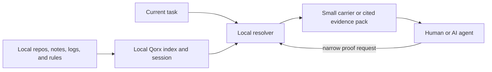

# Qorx Void architecture

This is the public system model, not an implementation specification.

## A turn in public terms

1. The operator indexes an authorized local workspace.
2. Qorx gives the workspace a local session handle.
3. The current objective is resolved against the local index under a declared
   evidence or token budget.
4. The agent receives a compact carrier, selected citations, or an explicit
   unsupported result.
5. If more proof is needed, the agent asks for a narrower local expansion.

The carrier is not a magical compression format that lets a remote model read
data it never received. It is a small local pointer or evidence frame whose
meaning depends on the local Qorx runtime.

## Public components

| Component | Public contract |
| --- | --- |
| Local index | Records authorized text, file references, and graph relationships on the machine. |
| Session | Identifies the current local evidence state with a `qorx://` handle. |
| Resolver | Selects bounded context for the current objective. |
| Carrier | A small handle, source artifact, bytecode artifact, or evidence pack. |
| Grounding gate | Checks whether cited local evidence supports the requested claim. |
| MCP server | Gives supported agents nine local Qorx tools over stdio. |
| Loopback gateway | Serves the local health, session, context, and proof endpoints. |
| Local ledger | Records disclosed token and reduction accounting. |

## Trust boundary

By default the gateway binds to `127.0.0.1:47187`. Local files, indexes, memory,
and private workspace state remain on the machine unless the operator asks an
agent or provider to receive selected output.

The provider boundary is explicit:

- Qorx can keep source material local.
- An agent sees the carrier or evidence text returned to it.
- Provider authentication remains with the provider client.
- A non-loopback deployment needs the operator's own authentication, TLS,
  network policy, supervision, and backups.

## Documentation boundary

This page intentionally stops at observable components and data movement. It
does not disclose proprietary Void algorithms, private source layout, internal
ranking weights, production signing and licensing flows, or release operations.
